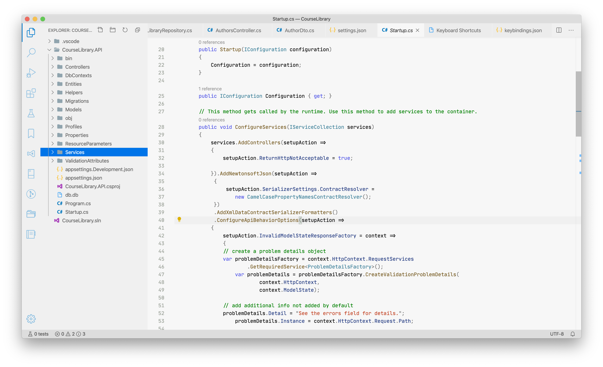
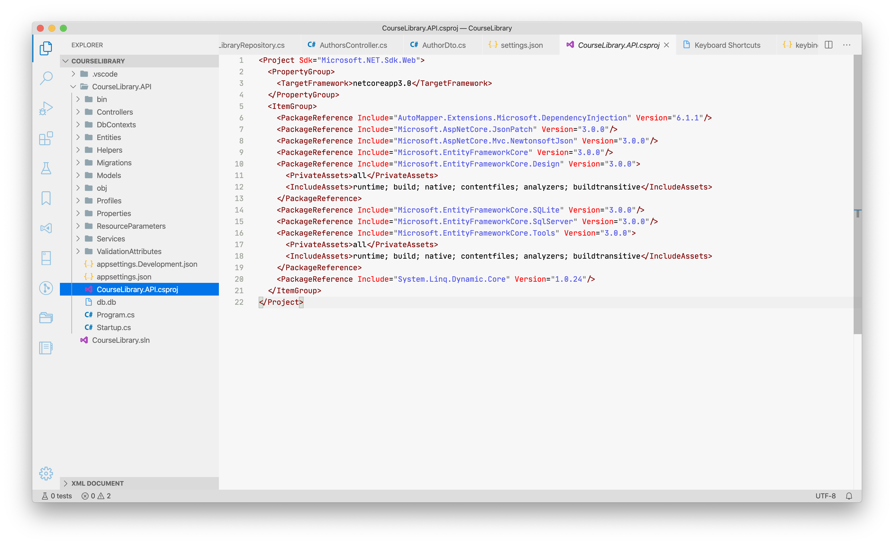
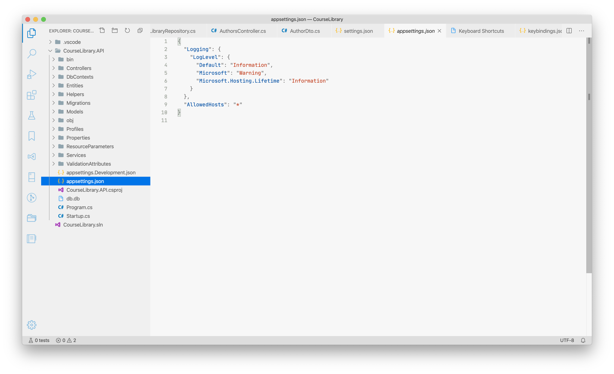

# Semantica Theme

A light theme witch combine colors from [Alabaster Theme](https://github.com/tonsky/vscode-theme-alabaster) and original Visual Studio and Rider syntax highlight.

## Screenshots

C# code:

XML:

JSON:

## Install

1. Open Visual Studio Code
2. Go to Extensions
3. Type 'Semantica' and click install
4. You are great

## Links

- [Original Alabaster theme](https://github.com/tonsky/vscode-theme-alabaster)
- [My blog post about this theme (rus)](https://stefaniuk.website/all/semantica-tema-dlya-visual-studio-code/)
- [Visual Studio Marketplace](https://marketplace.visualstudio.com/items?itemName=bogdanstefanjuk.theme-semantica)

## License

MIT

